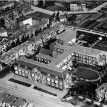
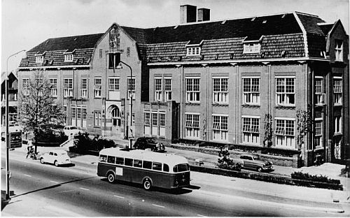

{.image_left} In 1979 the new RKZ ("Martini Hospital") finishes construction, situated on the Van Swietenlaan. The former or old RKZ (ORKZ) located on Emmastraat now becomes empty, waiting for a new destination. The municipality of Groningen and a contractor start studying different scenarios for destination plans. They reach an agreement in which the old RKZ will be demolished, after which the road is free to build new luxury apartments for people to buy.

{.image_right} A wonderful monumental building doomed to be demolished, and instead of that: expensive apartments for buying. And this in a time of great shortage on the living market. After several months of being empty, some members of eg. the "Kraak Organisatie Groningen" (KOG, squatting organisation in Groningen) and the "Groninger Studentenbond" (Student association of Groningen) decide to put action to their words. In the night of 2 to 3 september 1979 two people report themselves to the night's watchman, and succeed to lure him away from the entrance. Subsequently, a group of around a hundred squatters take possession of the hospital. The biggest squatted house of Netherlands is now a reality.

{.image_left} It is not long until the squatting action, which was meant temporarily, gets a permanent character: the start of 40 years of collective living in the ORKZ. In 1981 the municipality of Groningen buys the building, which until then was the property of the foundation "Stichting Onze Lieve Vrouwen Behoudenis der Kranken". The plans for reconstruction prove very difficult to materialize. The future of the ORKZ is very uncertain until in 1985 mr. Brokx, Secretary of State, declares the building legally inhabited. After speaking with the inhabitants he approves a self-governing-experiment for a duration of 5 years. The hospital, squatted in 1979, by that time has grown to a successfully managed and autonomously administrated living-and-working-building, with a board, a maintenance committee and a technical service.
