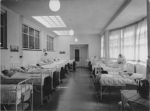
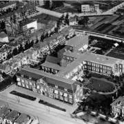
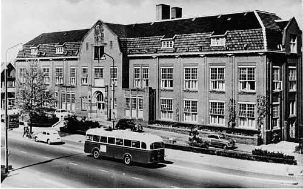

{.image_left} In 1979 is het nieuwe RKZ (Martini Ziekenhuis) aan de Van Swietenlaan klaar. Het nu oude RKZ aan de Emmastraat komt leeg te staan, wachtend op een nieuwe bestemming. De gemeente Groningen en een aannemer buigen zich over verschillende bestemmingsplannen. Men komt tot een overeenkomst waarin de sloop van het oude RKZ wordt voorzien, waarna op desbetreffende terrein nieuwe luxe koopwoningen gebouwd zullen worden.

{.image_right} Een prachtig monumentaal pand gedoemd tot sloop, en daarvoor in de plaats dure koopwoningen. En dit in een tijd van grote woningnood. Na enkele maanden leegstand besluiten mensen van onder meer de Kraak Organisatie Groningen (KOG) en de Groninger Studentenbond daad bij kracht te stellen. In de nacht van 2 op 3 september 1979 melden zich twee mensen bij de nachtportier, en weten hem bij de ingang weg te lokken. Vervolgens neemt een groep van ongeveer honderd krakers bezit van het Rooms Katholiek Ziekenhuis. Het grootste kraakpand van Nederland is een feit.

{.image_left} Al gauw krijgt de tijdelijk bedoelde kraakactie een permanent karakter: het begin van 40 jaar collectief wonen in het ORKZ. In 1981 koopt de gemeente Groningen het gebouw op, wat tot dan toe eigendom is van "Stichting Onze Lieve Vrouwen Behoudenis der Kranken". De plannen voor de verbouwing komen moeilijk op gang. De toekomst van het ORKZ is erg onzeker totdat in 1985 Staatssecretaris Brokx het gebouw legaal bewoond verklaart. Na overleg met de bewoners geeft hij toestemming voor een zelfbeheer-experiment voor de duur van 5 jaar. Het in 1979 gekraakte ziekenhuis is dan uitgegroeid tot een succesvol autonoom beheerd woon-werkpand, met onder meer een eigen bestuur, onderhoudscommissie en technische dienst.
