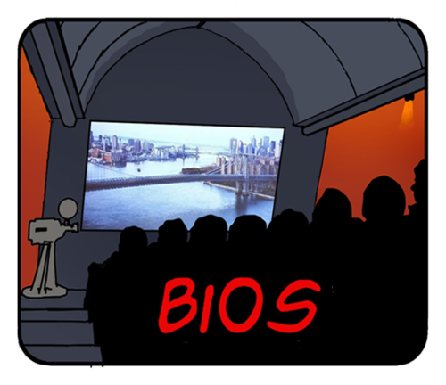

{.decorative-image}
RKZbios
-------

*Zie ook de [RKZbios website [fa=external-link /]](http://rkzbios.nl?target=_blank)*

De RKZbios onderscheidt zich als kleinste bioscoop van Groningen al 35 jaar door zijn unieke sfeer en eigenzinnige programmering. De RKZbios bevindt zich op de eerste verdieping van de Kapel van het Oude RKZ; de muurschildering van Jezus boven de projectiecabine herinnert nog aan de oude functie. De bios draait elke zaterdag en maandag, en soms ook op zondag. Verder is de bioscoopzaal te huur voor privévoorstellingen of lezingen.

In 1980 was het Oude Rooms Katholiek Ziekenhuis net een jaar gekraakt toen er elders in het gebouw voor het eerst op 16mm films werden vertoond. Een aantal jaren later werd het filmhuisje verplaatst naar de huidige locatie, bovenin de kapel. In de jaren negentig kwam er een 35mm-projector (die nu als relikwie uit vervlogen tijden voorin de zaal staat) en werd de zaal beetje bij beetje professioneler ingericht. Zo'n drie jaar terug werd er overgeschakeld op digitale projectie en is de zaal flink onder handen genomen. De Rkzbios is al 35 jaar een onafhankelijke bioscoop en klaar voor de toekomst!

**Openingstijden:** za/ma om 20.30. 
**Programma/aanmelden nieuwsbrief/contact** via de [RKZbios website](http://rkzbios.nl)

