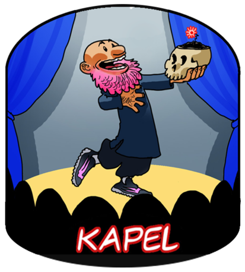

{.decorative-image}

Theater de Kapel
----------------

*Check out [www.theaterdekapel.nl [fa=external-link /]](http://www.theaterdekapel.nl)*

Theater de Kapel (TDK) is a theatre for and by artists. We try to be a stage where artists can completely go their own way. We don’t have a commercial purpose and work only with experienced volunteers. You can play at your own risk or start a collaboration with TDK… anything’s possible! So, theatrical performers, poets, musicians, entertainers, grab your opportunity with TdK. Because we think that everybody has the right to affordable art and culture. We want to take matters into our own hands. For renting the space for rehearsals or auditions, the price is negotiable. No weddings or parties! No loud music, no drums, because of the noise. On Saturdays and Mondays it is not possible to use the chapel after 20:30. Contact us for the conditions. 

**Contact** [ORKZ.programmeurs@gmail.com](mailto:chris@orkz.net)
