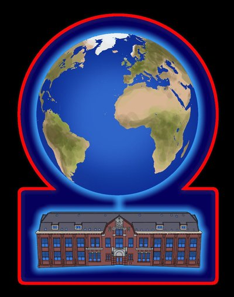

{.decorative-image}

The Network: ORXnet
-------------------

Check out [www.orxnet.org](http://www.orxnet.org)

In every room in the ORKZ there is the possibility for a cable or wifi connection. This is also arranged by volunteers, who are united in the ORXnet. We are open every Monday so you can come by to connect or disconnect your devices, or to ask for help when you have difficulties with your computer. 
Aside from a very fast connection, residents can also get a hosting for a personal website and cloud-storage. We also administer a guest network, where visitors can log on to the internet with a voucher code. 

**Opening hours:** ma om 20.30. 
**Contact:** info@orxnet.org

