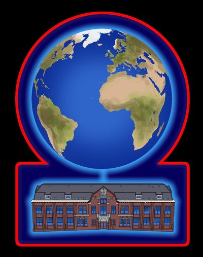

{.decorative-image}

Het netwerk: ORXnet
-------------------

--> zie ook [www.orxnet.org](http://www.orxnet.org)

In het Oude RKZ is op elke kamer een draadloze of bekabelde internetaansluiting mogelijk. Ook dit wordt geregeld door vrijwilligers, verenigd in de stichting ORXnet. Elke maandag kun je hier terecht om nieuwe apparaten aan te sluiten of af te melden, of om hulp te vragen wanneer er problemen zijn met je computer.

Naast een supersnelle verbinding kan iedere bewoner bij ORXnet terecht voor o.a. het hosten van een website, cloud-opslag van bestanden. Ook wordt er een gasten-netwerk beheerd waar bezoekers kunnen inloggen met een vouchercode.

**Openingstijden:** ma om 20.30. 
**Contact:** info@orxnet.org

